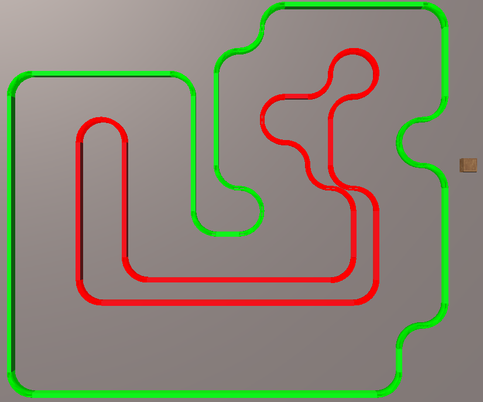
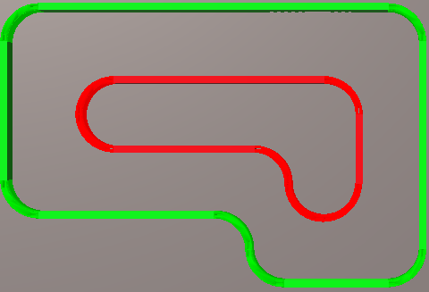

# Tutoriel : Modifier le monde de simulation Webots

Ce tutoriel a pour but de vous apprendre à modifier le monde de simulation Webots pour y ajouter des objets, des robots etc.

Piste 2023 ENS | Piste Saint-Cyr
:-------------------------:|:-------------------------:
      |


## Prérequis

Avoir installé Webots sur votre ordinateur (voir [tuto_installation.md](tuto_installation.md) pour plus d'informations).

## Procédure de modification du monde de simulation

### Depuis l'interface graphique

Pour déplacer un objet dans le monde de simulation, il suffit de le sélectionner dans l'arborescence à gauche de la fenêtre de visualisation graphique ou de cliquer directement dessus dans la fenêtre de visualisation graphique. Une fois l'objet sélectionné, il est possible de le déplacer en cliquant sur les axes de déplacement (flèches) ou de rotation (cercles).

Les objets peuvent être copiés, collés, supprimés, dupliqués, etc. en utilisant les boutons de l'interface graphique ou les raccourcis clavier associés.

### Depuis le fichier .wbt

Il est également possible de modifier le monde de simulation en modifiant le fichier ```.wbt``` associé.

Voici un exemple de l'ajout d'un obstacle dans le monde de simulation :

```proto
WoodenBox {
  translation 5 1.5 0.146076898211959
  rotation 0.06339729635525808 0.13255798328830493 0.9891456737414268 2.630091579783722e-16
  size 0.3 0.3 0.3
  mass 10
}
```

Il est possible de modifier les paramètres de l'objet (position, rotation, taille, masse, etc.) en modifiant les valeurs associées.